📜 **TODO LIST APPLICATION**

A React application for managing everyday tasks. Users can create, edit, complete, delete, search, filter and sort todos through a responsive interface connected to an API.

The project was built as part of my React development coursework and demonstrates component-based architecture, state management, API integration, authentication, routing, form validation, and optimistic UI updates.

✨ **FEATURES**

**Task Management**

- Create new todos
- Edit existing todo titles
- Mark todos as completed or active
- Delete todos
- Fetch and synchronize tasks with an API
- Display loading and error states

**Search, Filtering & Sorting**

- Search todos by title
- Debounced filtering to avoid unnecessary recalculations while typing
- Filter todos by status:

  - All
  - Active
  - Completed

- Sort todos by available sorting options:
  - Creation Date
  - Title
- Preserve the selected status in the URL using search parameters
- Display context-specific empty states when no todos match the selected filter

**Optimistic UI Updates**

  Todo operations use optimistic updates so changes appear in the interface immediately instead of waiting for the server response.

  If an API request fails, the application can roll back the optimistic change and display an appropriate error message.

**Authentication**

  - User login and logout
  - Authentication state shared across the application
  - Protected routes for authenticated content
  - Redirect unauthenticated users to the login page
  - Return users to the originally requested protected page after successful login
  - CSRF token support for authenticated API requests

**Routing**

  The application uses client-side routing for navigation between multiple pages, including:
  - Home
  - Login
  - Todos
  - Profile
  - About
  - 404 / Not Found

  Protected routes prevent unauthenticated users from accessing restricted pages.

**User Profile**

  The Profile page retrieves user-related todo information and displays task statistics, including:

  - Total todos
  - Completed todos
  - Active todos

**Clean & Minimalistic Design**

  A clean, responsive interface keeps task management simple and easy to navigate across desktop and mobile devices.

📸 **APPLICATION PREVIEW**

**Todo Management**

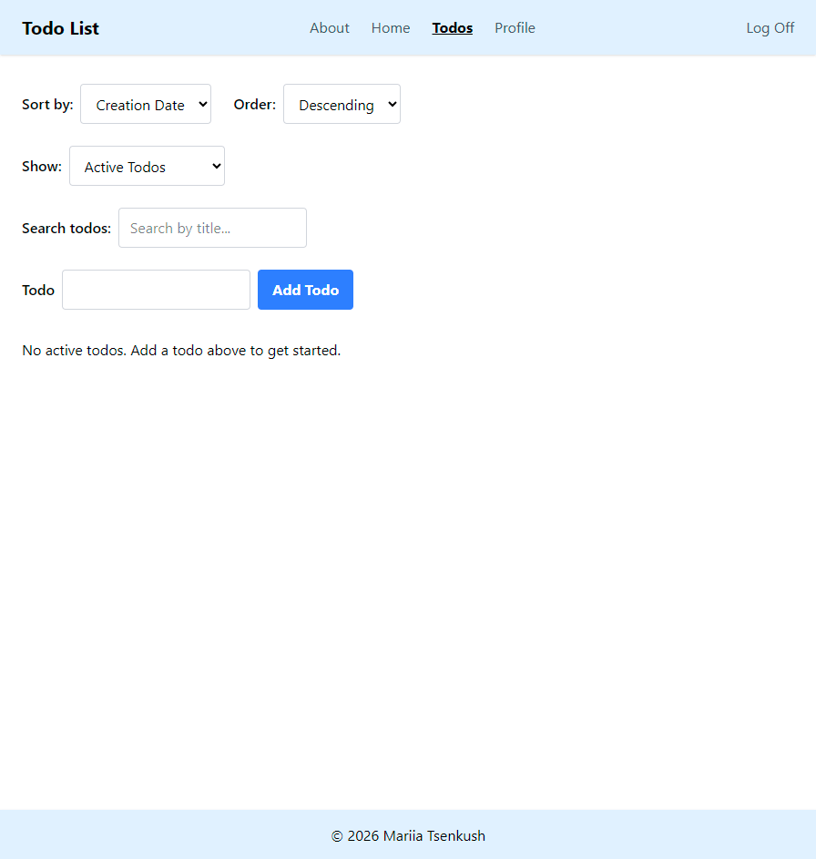

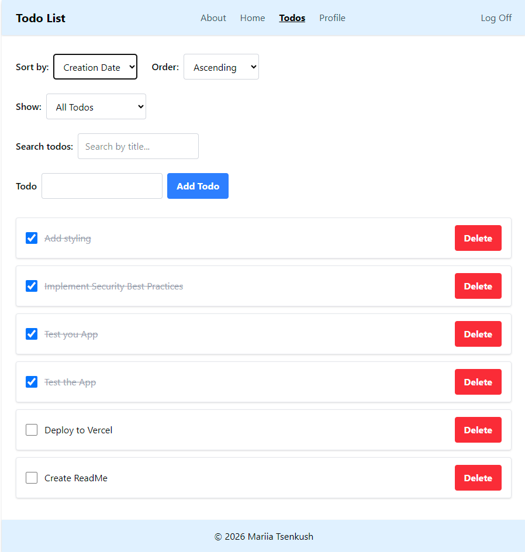

**Filtering Todos**

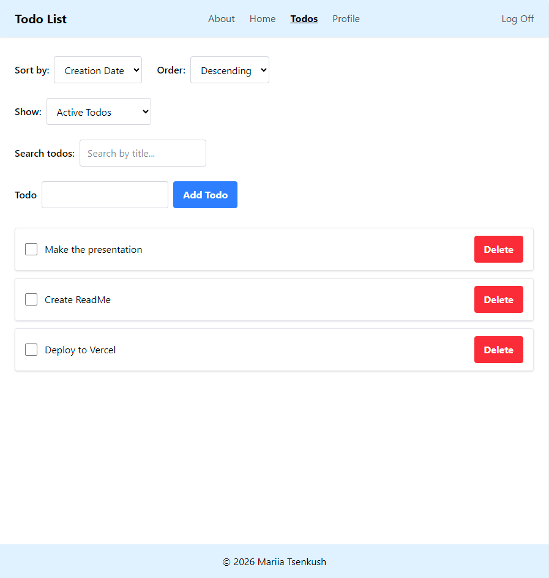

**Filtering and Sorting Errors**

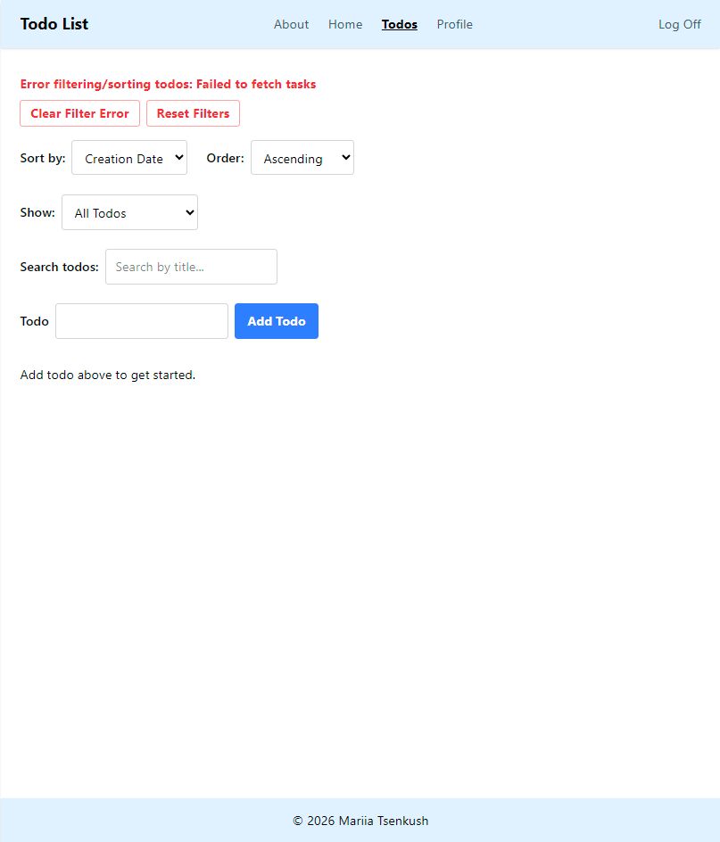

**Adding or Editing Todos**

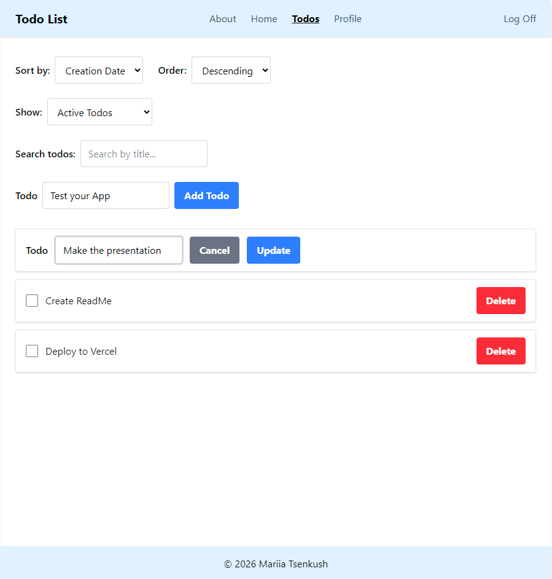

**Adding or Editing Todos Errors**

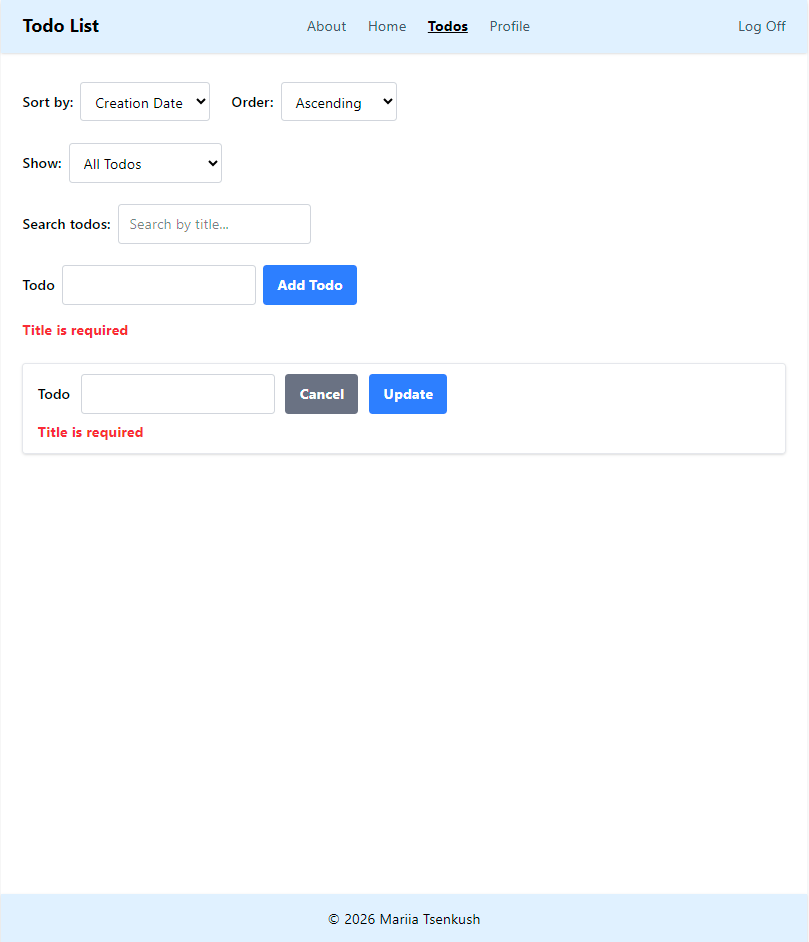

**Profile**

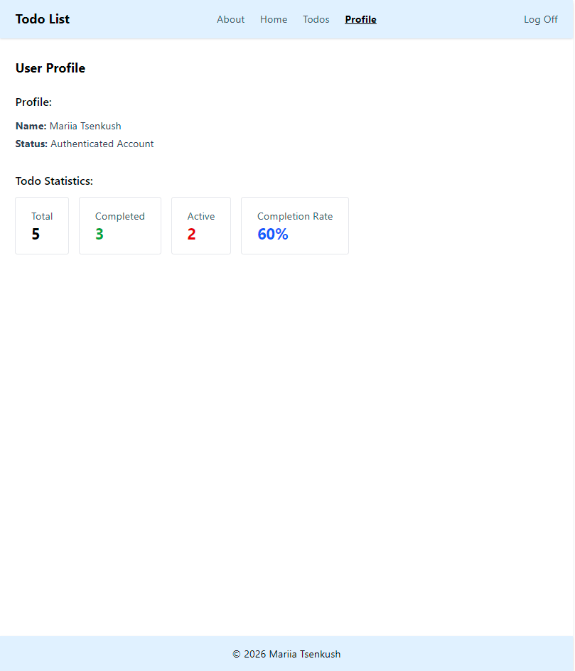

**Authentication**

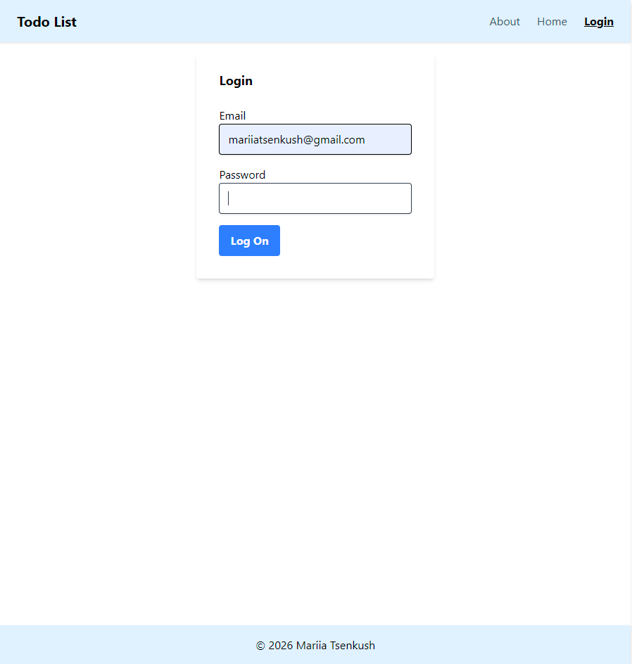

**Authentication Errors**

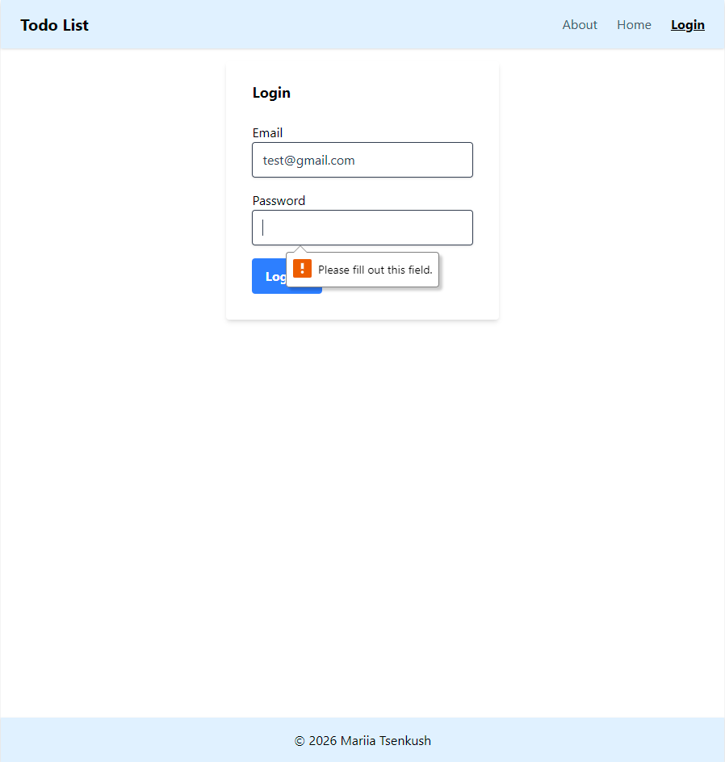

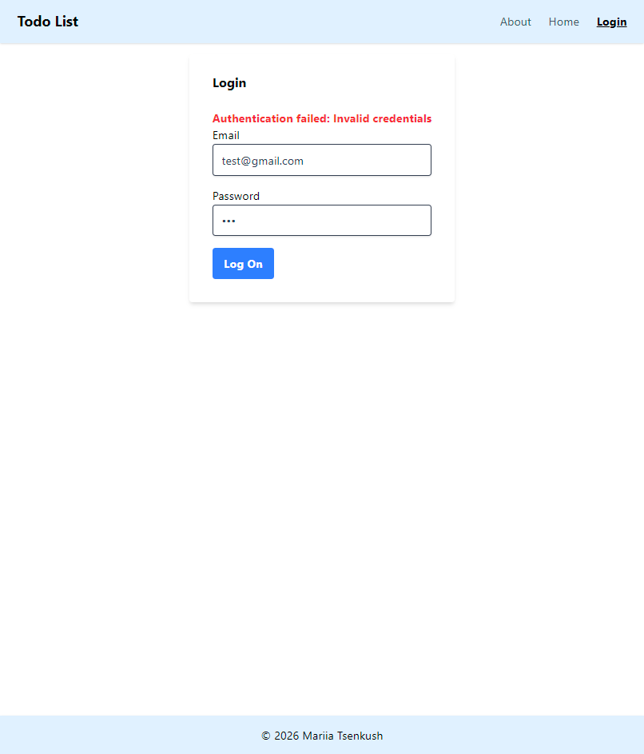

**404 Page**

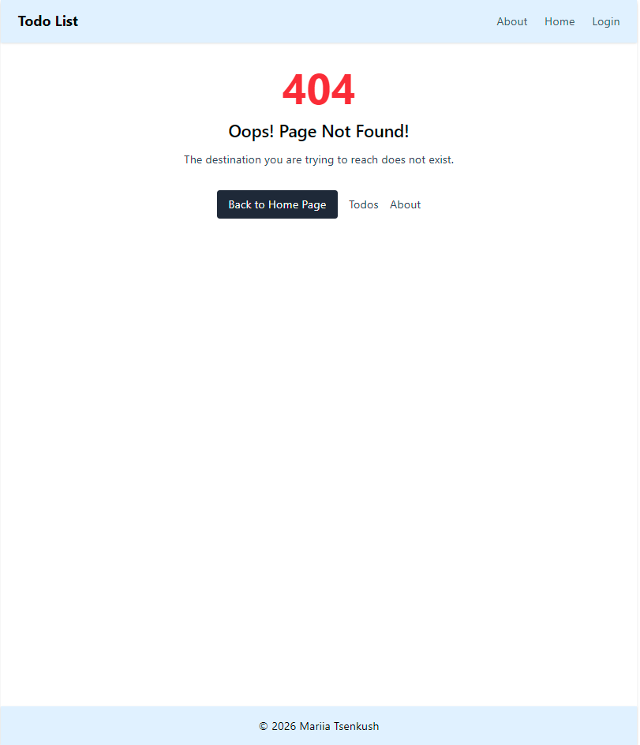

**About Page**

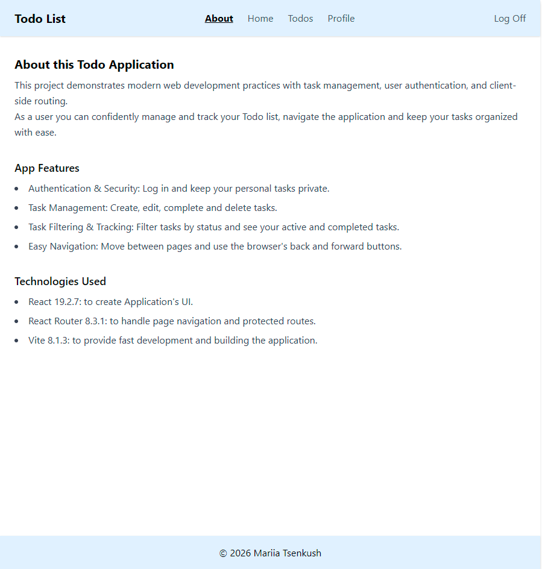

**Responsive Design**

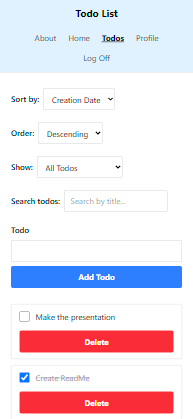

🛠️ **TECHNOLOGIES**

- JavaScript
- React 19.2.7
- React Router 8.3.1
- Vite 8.1.3
- HTML5
- CSS
- Tailwind
- REST API
- Git & GitHub
- ESLint

**React Concepts & Hooks**

The project uses modern React patterns including:

- useState
- useEffect
- useReducer
- useContext
- useMemo
- custom hooks

🧠 **STATE MANAGEMENT**

As the application grew, todo state was moved into a useReducer architecture.

Instead of updating multiple related state values independently, user and API events dispatch actions to the reducer. This keeps task operations, loading states, errors, and optimistic updates organized in one predictable state flow.

The reducer handles operations such as:

- loading todos
- adding todos
- updating todos
- completing todos
- deleting todos
- optimistic updates
- API success and failure
- rollback after failed requests
- filter and UI-related state

This was one of the most important architectural changes made during the development of the project.

⚡ **OPTIMISTIC UPDATES & ERROR HANDLING**

For task operations, the UI can update before the API request finishes.

For example, when a user completes a todo:

The application immediately updates the todo in the interface.
The request is sent to the API.
If the request succeeds, the optimistic state is confirmed.
If the request fails, the previous state can be restored and an error is displayed.

This approach makes the application feel faster while still keeping the UI synchronized with the server.

🔎 **FILTERING & PERFORMANCE**

Todo filtering is memoized so the filtered list does not need to be recalculated on every unrelated render.

The application also uses a debounced text filter, allowing the user to type a search query without immediately triggering filtering logic for every keystroke.

Status filtering is connected to the URL through React Router search parameters.

For example:

- /todos?status=active
- /todos?status=completed

This makes filter state compatible with browser navigation and allows the selected view to be represented directly in the URL.

🔐 **AUTHENTICATION & PROTECTED ROUTES**

Authentication state is shared through React Context.

Protected pages use a route guard to check whether the user is authenticated. When an unauthenticated user attempts to access a protected route, the application redirects to the login page while preserving the original destination.

After successful authentication, the user can be returned to the page they originally attempted to visit.

Authenticated API requests include the required CSRF token and credentials.

🧩 **COMPONENT STRUCTURE**

The application is divided into reusable pages and components, including components for:

- navigation
- authentication
- todo forms
- todo lists
- individual todo items
- status filtering
- protected routes
- user profile
- error and Not Found states

The component structure separates UI responsibilities from task-management and authentication logic, making the application easier to maintain and extend.

🚀 **HOW TO RUN**

**Prerequisites**

Make sure Node.js and npm are installed on your computer.

**Installation**

- Fork then clone locally:

  [GitHub Repository link](https://github.com/MTsenkush/Todo-List)

- Navigate into the project directory:

  cd YOUR_PROJECT_FOLDER

- Install dependencies:

  npm install

- Start the development server:

  npm run dev

- Open the local URL displayed by Vite in your browser.

**Available Scripts**

`npm run dev`

Starts the Vite development server.

`npm run build`

Creates an optimized production build.

`npm run preview`

Runs the production build locally for testing.

`npm run lint`

Checks the project for ESLint issues.

`npm audit`

Checks project dependencies for known vulnerabilities.

`npm audit fix`

Attempts to automatically fix compatible dependency vulnerabilities.

🚀 **LIVE DEMO FOR CTD AUTHORIZED USERS** 

**Project Deployed on VERCEL**

[Link to try out the App](https://todo-list-fawn-pi.vercel.app/)

🔗 **BACKEND API**

This project is a frontend React application built on top of the backend API provided as part of the Code the Dream curriculum.

🎥 **PROJECT PRESENTATION**

Watch a short presentation of the Todo List Application

▶️ [Link on YouTube](https://youtu.be/FhzqvVBx6FI)

🧩 **CHALLENGES & WHAT I LEARNED**

One of the main challenges in this project was moving from simple component state to a reducer-based architecture.

As more functionality was introduced—API requests, editing, completion, deletion, filtering, sorting, loading states, and errors—managing related state independently became increasingly difficult.

Using useReducer helped organize these changes into explicit actions and made it possible to implement optimistic updates with rollback behavior when API requests fail.

Another important part of the project was authentication and routing. Implementing protected routes required coordinating authentication state, redirects, and the user's original destination so navigation remained predictable before and after login.

The project also provided practical experience with API communication, asynchronous JavaScript, React Context, URL-based state, memoization, reusable components, and error handling.

🔮 **FUTURE IMPROVEMENTS**

Possible future improvements include:

- Separate handling of 401 on API calls with forced log off
- Drag-and-drop todo reordering (with introduction of unsorted state)
- Confirmation popup on Delete
- Loading spinner overlay
- Additional accessibility improvements
- Automated testing
- Expanded user profile functionality

📬 **CONTACT ME**

Email: mariiatsenkush@gmail.com

[LinkedIn](https://www.linkedin.com/in/mariia-tsenkush/)

[GitHub](https://github.com/MTsenkush)